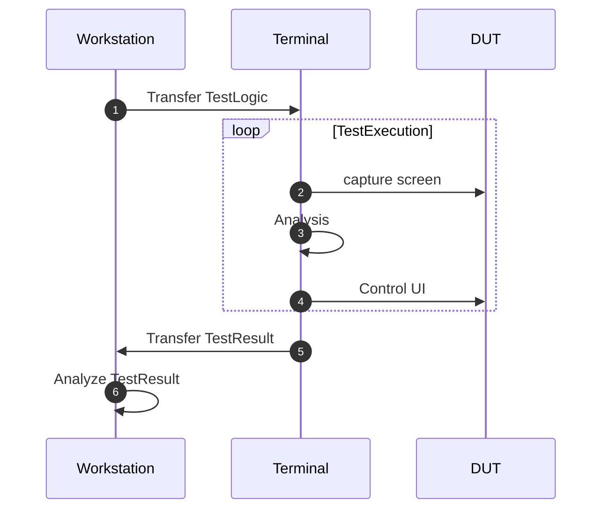
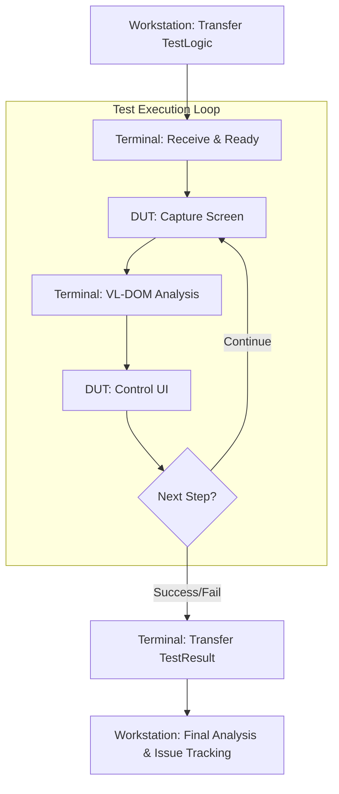

# AIQA-Pipeline

## About Document

1. Title    aiqa-pipeline
2. Version  v0.1.0
3. Update   2026.04.05
4. Author   pearlRise
5. Status   WIP

## Details

```mermaid
sequenceDiagram

    autonumber
    participant W as Workstation
    participant T as Terminal
    participant D as DUT

    W->>T: Transfer TestLogic

    loop TestExecution
        T->>D: capture screen
        T->>T: Analysis
        T->>D: Control UI
    end

    T->>W: Transfer TestResult
    W->>W: Analyze TestResult
```

```mermaid
graph TD
    %% 노드 정의
    W1[Workstation: Transfer TestLogic] --> T1[Terminal: Receive & Ready]
    
    %% 테스트 수행 루프
    subgraph Execution [Test Execution Loop]
        T1 --> C[DUT: Capture Screen]
        C --> A[Terminal: VL-DOM Analysis]
        A --> U[DUT: Control UI]
        U --> D{Next Step?}
        D -- "Continue" --> C
    end
    
    %% 결과 전송 및 분석
    D -- "Success/Fail" --> R[Terminal: Transfer TestResult]
    R --> F[Workstation: Final Analysis & Issue Tracking]
```